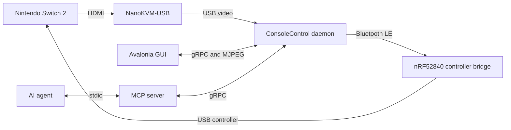

# ConsoleControl

ConsoleControl lets a person or an AI agent operate a game console through captured video and an emulated controller. A local daemon owns the hardware, an Avalonia GUI provides interactive control, and an MCP server gives agents a bounded automation interface.

The current hardware target is a docked Nintendo Switch 2. A NanoKVM-USB captures HDMI video, while a small nRF52840 board presents a Switch-compatible USB controller. The NanoKVM's stock control connection cannot emulate the required controller, so ConsoleControl uses it only for video capture.

The controller, GUI, live-video, and digital MCP paths have all passed on the target hardware. This is still a development build. Portable desktop release archives and unattended firmware updates are not available yet.

## What works

- Live video from a selectable V4L2 capture source
- On-screen digital controls
- Focused keyboard forwarding
- SDL gamepad forwarding with per-device mappings
- One control lease shared between the GUI and automation clients
- GUI takeover of a running automation sequence
- MCP screenshots at three fidelity levels
- Individual digital presses, bounded holds, and timed sequences
- Controller-bridge and video-source discovery through both the GUI and MCP
- Automatic recovery after daemon or capture-device interruption

Analog MCP control, motion, rumble, audio, recording, remote access, and Windows support are outside the current release.

## How the pieces fit



The daemon owns capture, the controller bridge, device selection, and control arbitration. The GUI and MCP server are clients. Only one client can send controller input at a time, but every client may continue to observe video.

See [the architecture](docs/architecture.md), [the domain language](CONTEXT.md), and [the accepted design decisions](docs/adr/) for the implementation boundaries.

## Hardware

The tested setup uses:

- A docked Nintendo Switch 2
- A NanoKVM-USB connected as a UVC capture device
- A controller bridge built around the Nordic Semiconductor nRF52840 microcontroller
- The tested board is the [Teyleten Robot Pro Micro nRF52840 clone](https://www.amazon.com/dp/B0CYLNZ6V4), Amazon ASIN `B0CYLNZ6V4`
- A Linux computer with Bluetooth and a free USB capture connection

The controller bridge runs C++ firmware built with Adafruit's nRF52 Arduino core, TinyUSB, and Bluefruit. The firmware presents a wired Switch Pro-compatible controller to the console and receives complete controller states over Bluetooth LE.

Other nRF52840 clones may be compatible, but only the linked Teyleten board has passed the hardware tests. Read [the hardware proof procedure](docs/hardware-proof.md) before flashing another board. Boards can differ in pinout, bootloader, SoftDevice, and flash layout even when their listings look identical.

## Development requirements

The desktop applications currently require:

- .NET 10 SDK
- Linux with BlueZ and V4L2
- `ffmpeg` and `v4l2-ctl` on `PATH`
- A controller bridge flashed with a locally built ConsoleControl firmware image

ConsoleControl releases do not include a controller-bridge UF2. Build and flash the firmware with [the nRF52840 hardware procedure](docs/hardware-proof.md).

Restore and build the solution:

```sh
dotnet restore ConsoleControl.slnx
dotnet build ConsoleControl.slnx --no-restore
```

Run the repeatable desktop checks:

```sh
tools/verify-desktop-slice.sh
```

## Run the GUI

Connect the controller bridge to the Switch dock and connect the NanoKVM-USB to the computer. Start the daemon:

```sh
dotnet run --project src/ConsoleControl.Daemon -- \
  --listen http://127.0.0.1:5041 \
  --video-listen http://127.0.0.1:5042 \
  --adapter hci0
```

Start the GUI in another terminal:

```sh
dotnet run --project src/ConsoleControl.Gui -- \
  --daemon http://127.0.0.1:5041
```

Choose a controller bridge and video source. Then choose **Take Control** before sending input. The GUI starts as an observer so an automation client can retain control while a user watches.

Choose a keyboard or gamepad from the input-source list. Only the selected source sends input. Keyboard input is active only while the GUI has focus. Switching sources, losing focus, or disconnecting the selected gamepad clears the current controller state.

To edit a mapping, choose **Configure input mapping...**. Select a Switch control in the controller diagram, then press the key, button, trigger, or stick direction that should activate it. A Switch control may have several bindings. Profiles are stored by keyboard identity or SDL device GUID, so equivalent controllers reuse the same mapping.

## Run the MCP server

The MCP server communicates over stdio and expects the daemon to be running. Configure an MCP client to launch:

```sh
dotnet run --project src/ConsoleControl.Mcp -- \
  --daemon http://127.0.0.1:5041
```

This repository contains a project-scoped Codex configuration in [`.codex/config.toml`](.codex/config.toml). It uses an absolute development path and is not suitable for redistribution as written.

An agent starts by reading status, selecting unavailable hardware when necessary, and requesting control with a reason. If the GUI holds control, the user sees that reason and decides whether to release it. The GUI can take control back at any time, which stops the running sequence and neutralizes the controller.

The MCP server supports:

- Cached daemon and hardware status
- Controller-bridge and video-source inventory and selection
- Control requests and release
- Retained screenshots at low, medium, and original fidelity
- Atomic digital presses and bounded holds
- Timed sequences with overlapping holds, pauses, and screenshots

Sequences are limited to 256 commands, 30 seconds, eight screenshots, and 32 MiB of original screenshot data. Analog automation is not implemented.

Agents can use [the ConsoleControl operation skill](.agents/skills/operate-console-control/SKILL.md) and [the Switch navigation skill](.agents/skills/navigate-nintendo-switch/SKILL.md). The operation skill asks whether the user wants a watched GUI session or a headless session before it starts the local processes.

## Planned release archives

The first published release will be a portable, self-contained Linux archive. Users will not need the repository or .NET SDK. The archive will contain:

```text
ConsoleControl-linux-x64/
├── bin/
│   ├── consolecontrol-daemon
│   ├── consolecontrol-gui
│   └── consolecontrol-mcp
├── libexec/
│   └── consolecontrol/
│       ├── daemon/
│       ├── gui/
│       └── mcp/
├── controller-personalities/
├── skills/
├── examples/
│   └── codex-config.toml
├── third-party-licenses/
├── LICENSE
└── THIRD-PARTY-NOTICES.md
```

The commands under `bin/` launch directory-based, self-contained .NET applications under `libexec/`. This keeps the command names short without depending on single-file extraction for Avalonia, SDL, or SkiaSharp.

GitHub Actions validates every push and pull request. A `vMAJOR.MINOR.PATCH` tag runs the same validation before it builds the desktop archive, generates checksums, and creates a GitHub Release. Tagged CI also builds the controller firmware twice and verifies that both outputs are identical and stay inside the recorded application range. The workflow does not upload the firmware output or include it in the GitHub Release. Users build the UF2 locally by following [the hardware procedure](docs/hardware-proof.md).

The first archive will target `linux-x64`. Windows needs platform-specific capture and Bluetooth adapters, so a Windows archive would be misleading today.

## Repository layout

```text
src/                       .NET applications and libraries
tests/                     domain, protocol, and integration tests
firmware/                  nRF52840 controller-bridge firmware
controller-personalities/  runtime USB controller definitions
docs/                      architecture, decisions, and hardware notes
tools/                     verification and hardware utilities
.agents/skills/            agent operation and navigation guidance
```

Every .NET project has its own directory. Hardware-specific behavior stays behind adapters so future console personalities do not leak into the daemon's control policy.

## Firmware updates and recovery

The installed UF2 bootloader remains the recovery path. A double reset exposes the UF2 volume even when an application image fails. Ordinary controller input and personality changes stay in RAM and do not write flash.

Signed over-the-air updates, interrupted-update rollback, and USB maintenance updates remain planned work. ConsoleControl will not describe OTA as safe until power-loss and invalid-image recovery pass on the purchased boards.

## Protocol and dependency provenance

[OpenPuck](https://github.com/safijari/openpuck) was a research reference for Switch-compatible controller behavior on nRF52840 hardware. ConsoleControl implements that behavior independently and does not copy OpenPuck's AGPL source. NanoKVM-USB and OpenPuck are not distributed dependencies.

See [the third-party notices](THIRD-PARTY-NOTICES.md) and [the dependency license audit](docs/research/dependency-license-audit.md) for shipped dependency licenses and release obligations.

## License

ConsoleControl is licensed under the GNU General Public License, version 3 or any later version. See [LICENSE](LICENSE).
